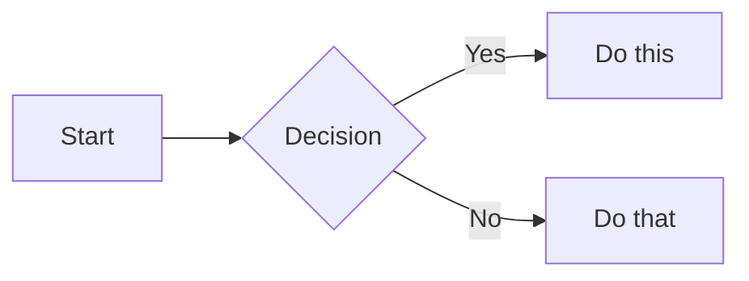

# Obsidian 风格 Markdown

创建和编辑符合规范的 Obsidian 风格 Markdown。Obsidian 在 CommonMark 和 GFM 基础上扩展了双链、嵌入、标注、属性、注释等语法。本 skill 仅涵盖 Obsidian 特有的扩展 —— 标准 Markdown（标题、加粗、斜体、列表、引用、代码块、表格）属于默认已掌握的内容。

## 工作流程：创建 Obsidian 笔记

1. **添加 frontmatter**：在文件顶部写入属性（标题、标签、别名）。所有属性类型参见 [PROPERTIES.md](references/PROPERTIES.md)。
2. **撰写内容**：使用标准 Markdown 构建结构，配合下文介绍的 Obsidian 特有语法。
3. **关联笔记**：使用双链（`[[笔记]]`）连接库内的其他笔记；外部链接使用标准 Markdown 链接格式。
4. **嵌入内容**：使用 `![[嵌入]]` 语法内联嵌入其他笔记、图片或 PDF。所有嵌入类型参见 [EMBEDS.md](references/EMBEDS.md)。
5. **添加标注**：使用 `> [!类型]` 语法高亮重要信息。所有标注类型参见 [CALLOUTS.md](references/CALLOUTS.md)。
6. **验证**：在 Obsidian 阅读视图中确认笔记渲染正确。

> 双链与 Markdown 链接的选择原则：库内笔记用 `[[双链]]`（Obsidian 会自动追踪重命名），外部链接仅用 `[文本](url)`。

## 协议：创建有效的双链（关键）

**严禁编造双链。** 模型常产生幻觉，虚构不存在的笔记名。请严格遵守以下协议：

### 创建任何 `[[双链]]` 之前

1. **发现**：在建立链接前，先搜索库中的候选笔记：
   ```bash
   obsidian search query="<关键词>" limit=20
   # 或列出所有笔记的 basename：
   obsidian eval code="app.vault.getMarkdownFiles().map(f => f.basename).join('\n')"
   ```

2. **精确匹配**：仅使用出现在搜索结果中的名称。双链 `[[笔记名]]` 必须与目标文件的 basename（不含 `.md`）**完全一致**。

3. **验证**（如不确定）：读取笔记确认其存在：
   ```bash
   obsidian read file="笔记名"
   ```

### 如果目标笔记不存在

- **选项 A**：先创建目标笔记，再添加双链。
- **选项 B**：使用纯文本代替链接。
- **选项 C**：使用标签 `#主题` 进行分类。
- **严禁** 创建指向不存在笔记的 `[[链接]]`。

### 别名

如果笔记的 frontmatter 中有 `aliases`，你可以在双链中使用别名（例如 `[[真实名称|别名]]`），但前提是已验证该别名存在于该笔记的属性中。

## 内部链接（双链）

```markdown
[[笔记名]]                          链接到笔记
[[笔记名|显示文本]]                  自定义显示文本
[[笔记名#标题]]                      链接到指定标题
[[笔记名#^块ID]]                    链接到指定块
[[#同笔记内的标题]]                  同笔记标题链接
```

在任何段落末尾追加 `^块ID` 即可定义块标识：

```markdown
这段文字可以被链接到。 ^my-block-id
```

对于列表和引用，将块 ID 放在块后的独立行：

```markdown
> 一段引用

^quote-id
```

## 嵌入

在双链前加 `!` 即可将其内容内联嵌入：

```markdown
![[笔记名]]                         嵌入整篇笔记
![[笔记名#标题]]                    嵌入指定章节
![[image.png]]                      嵌入图片
![[image.png|300]]                  嵌入图片并指定宽度
![[document.pdf#page=3]]            嵌入 PDF 指定页
```

音频、视频、搜索嵌入及外部图片等更多类型参见 [EMBEDS.md](references/EMBEDS.md)。

## 标注

```markdown
> [!note]
> 基础标注。

> [!warning] 自定义标题
> 带自定义标题的标注。

> [!faq]- 默认折叠
> 可折叠标注（- 折叠，+ 展开）。
```

常用类型：`note`、`tip`、`warning`、`info`、`example`、`quote`、`bug`、`danger`、`success`、`failure`、`question`、`abstract`、`todo`。

完整列表含别名、嵌套及自定义 CSS 标注参见 [CALLOUTS.md](references/CALLOUTS.md)。

## 属性（Frontmatter）

```yaml
---
title: 我的笔记
date: 2024-01-15
tags:
  - project
  - active
aliases:
  - 替代名称
cssclasses:
  - custom-class
---
```

默认属性：`tags`（可搜索标签）、`aliases`（链接建议的替代笔记名）、`cssclasses`（样式类）。

所有属性类型、标签语法规则及进阶用法参见 [PROPERTIES.md](references/PROPERTIES.md)。

## 标签

```markdown
#tag                    行内标签
#nested/tag             层级嵌套标签
```

标签可包含字母、数字（不能作为首字符）、下划线、连字符和斜杠。也可在 frontmatter 的 `tags` 属性中定义。

## 注释

```markdown
这是可见 %%但这段隐藏%% 的文字。

%%
整段内容在阅读视图中隐藏。
%%
```

## Obsidian 特有格式

```markdown
==高亮文本==                   高亮语法
```

## 数学公式（LaTeX）

```markdown
行内：$e^{i\pi} + 1 = 0$

块级：
$$
\frac{a}{b} = c
$$
```

## 图表（Mermaid）

**方向规则**：优先使用**横向布局**（`graph LR` 或 `graph RL`），而非纵向（`graph TD` 或 `graph BT`），以便在宽屏上获得更好的可读性，并符合从左到右的阅读流。仅在图表本质上是层级结构（如组织架构图、深度树）或宽度严重受限时，才使用纵向布局。

````markdown

````

如需将 Mermaid 节点链接到 Obsidian 笔记，添加 `class NodeName internal-link;`。

## 脚注

```markdown
带脚注的正文[^1]。

[^1]: 脚注内容。

行内脚注。^[这是行内脚注。]
```

## 完整示例

````markdown
---
title: Project Alpha
date: 2024-01-15
tags:
  - project
  - active
status: in-progress
---

# Project Alpha

本项目旨在使用现代技术[[改进工作流程]]。

> [!important] 关键截止日期
> 首个里程碑截止于 ==1 月 30 日==。

## 任务

- [x] 初期规划
- [ ] 开发阶段
  - [ ] 后端实现
  - [ ] 前端设计

## 笔记

该算法采用 $O(n \log n)$ 排序。详见 [[Algorithm Notes#Sorting]]。

![[Architecture Diagram.png|600]]

审阅记录见 [[Meeting Notes 2024-01-10#Decisions]]。
````

## 参考

- [Obsidian Flavored Markdown](https://help.obsidian.md/obsidian-flavored-markdown)
- [Internal links](https://help.obsidian.md/links)
- [Embed files](https://help.obsidian.md/embeds)
- [Callouts](https://help.obsidian.md/callouts)
- [Properties](https://help.obsidian.md/properties)
